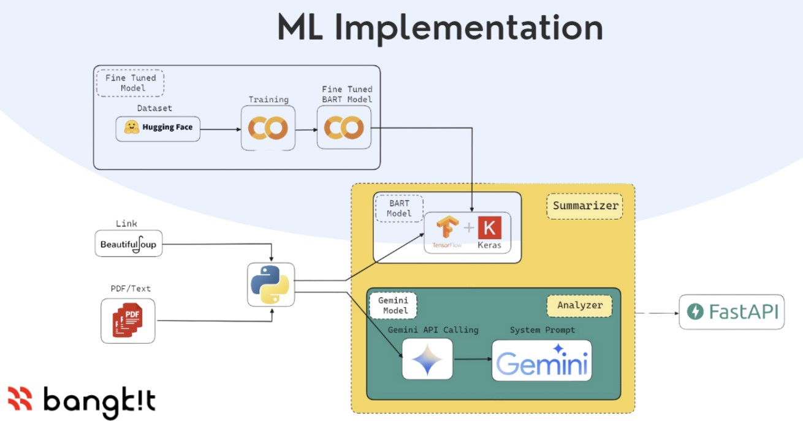
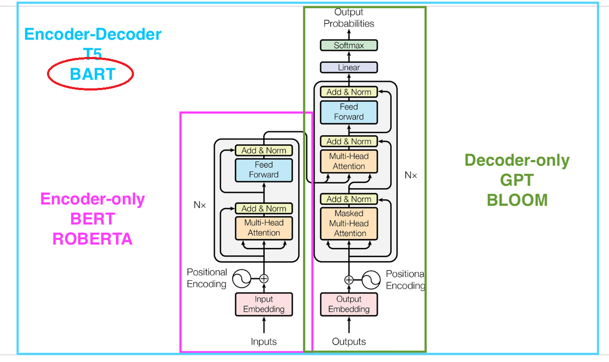

# Summasphere bangkit-machine-learning

The source code of machine learning model's API of Summasphere smart guide in order to complete Bangkit Capstone Project

<p align="center">
    

# Model Building's Notebook
[Bart Large Notebook](https://raw.githubusercontent.com/Summasphere/bangkit-machine-learning/main/tensorflow-summarizer-model-with-bart.ipynb)

# Dataset Resources
- [Multi News Summarization Dataset](https://huggingface.co/datasets/alexfabbri/multi_news)
- [CNN Dailymail Summarization Dataset](https://huggingface.co/datasets/abisee/cnn_dailymail)

# API Endpoint

<center>

| Endpoint |   Method   | Body Sent (JSON) |              Description              |
| :------: | :--------: | :--------------: | :-----------------------------------: |
|   /api/summarize  |    POST    |     - mode **(text, pdf, link)**<br>- model **(bart, gemini)**<br>- text [optional]<br>- file [optional]<br>- url [optional]     |   HTTP POST REQUEST for Summarization Task  |
|   /api/analyzer  |    POST    |     - media **(frontend, android)**<br>- mode **(pdf, link)**<br>- text [optional]<br>- file [optional]<br>- url [optional]     |   HTTP POST REQUEST for Topic Analyzer Task  |

</center>

# The flow of Machine Learning Service
<p align="center">
    

# How to run this FastAPI app
- Clone this repo
- Open terminal and go to fastapi-summasphere directory by typing<br>
`cd fastapi-summasphere`
- Type `py -m venv env` to create python virtual environment
- Activate python virtual environment
    ```bash
    <!-- Windows -->
    env\Scripts\activate.bat

    <!-- Linux -->
    source env/bin/activate
    ```
- Type `pip install -r requirements.txt` to install neccesary library
- Run the app
    > These examples run the server program (e.g Uvicorn), starting a single process, listening on all the IPs (0.0.0.0) on a predefined port (e.g. 80)
    ```py
    fastapi dev app.py

    <!-- For Production -->
    fastapi run 

    OR 

    uvicorn app.main:app --reload

    ```


# FastAPI Docs
<p align="center">
    

# Endpoint Testing
- **/api/summarize** for URL
<p align="center">
    

- **/api/summarize** for PDF
<p align="center">
    

- **/api/analyzer** for URL
<p align="center">
    

- **/api/analyzer** for PDF
<p align="center">
    

# Architecture of Bart Large Seq2Seq NLP Model 
<p align="center">
    

# References
- Liu, Y., & Lapata, M. (2019). Text Summarization with Pretrained Encoders. arXiv preprint arXiv:1908.08345. Retrieved from [https://arxiv.org/abs/1908.08345](https://arxiv.org/abs/1908.08345)
- Lewis, M., Liu, Y., Goyal, N., Ghazvininejad, M., Mohamed, A., Levy, O., ... & Zettlemoyer, L. (2019). BART: Denoising Sequence-to-Sequence Pre-training for Natural Language Generation, Translation, and Comprehension. arXiv preprint arXiv:1910.13461. Retrieved from [https://arxiv.org/abs/1910.13461](https://arxiv.org/abs/1910.13461)
- Fabbri, A., Li, I., She, T., Li, S., & Radev, D. (2019). Multi-News: A Large-Scale Multi-Document Summarization Dataset and Abstractive Hierarchical Model. arXiv preprint arXiv:1906.01749. Retrieved from [https://arxiv.org/abs/1906.01749](https://arxiv.org/abs/1906.01749)
