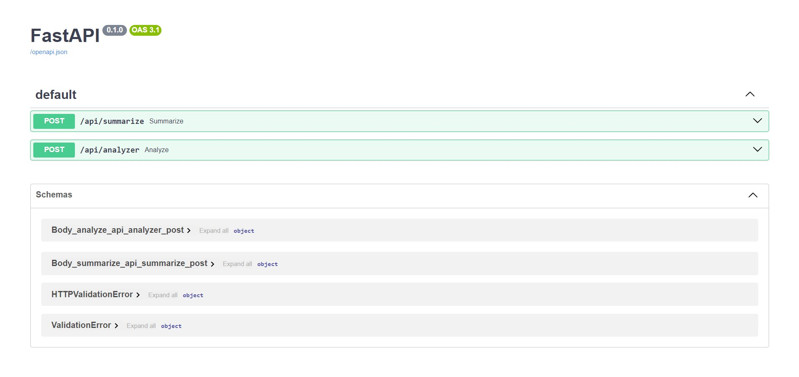

## Run

```py
py main.py
```

OR 

```py
fastapi dev app.py
```

OR 
```py
uvicorn app.main:app --reload
```

## FastAPI Docs
<p align="center">
    

## Endpoint Testing
- **/api/summarize** for URL
<p align="center">
    

- **/api/summarize** for PDF
<p align="center">
    

- **/api/analyzer** for URL
<p align="center">
    

- **/api/analyzer** for PDF
<p align="center">
    