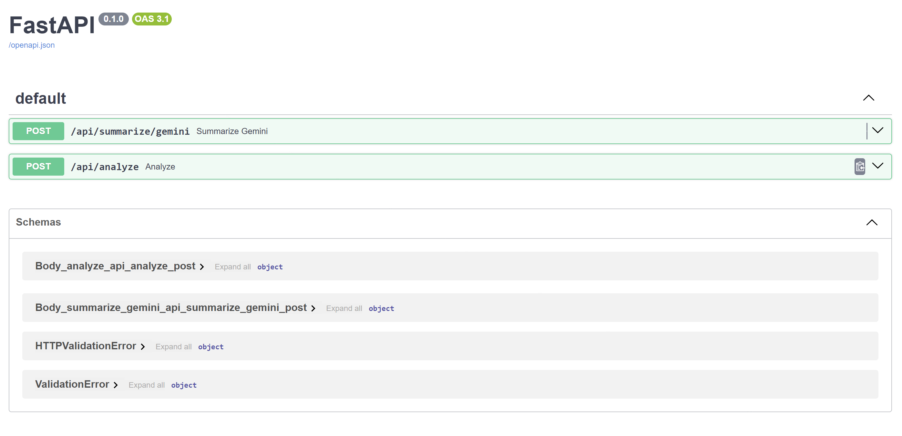

## Run
```py
uvicorn app.main:app --reload
```

## FastAPI Docs
<p align="center">
    

## Endpoint Testing
- **/api/summarize/gemini** for URL
<p align="center">
    

- **/api/summarize/gemini** for PDF
<p align="center">
    

- **/api/analyzer** for URL
<p align="center">
    

- **/api/analyzer** for PDF
<p align="center">
    